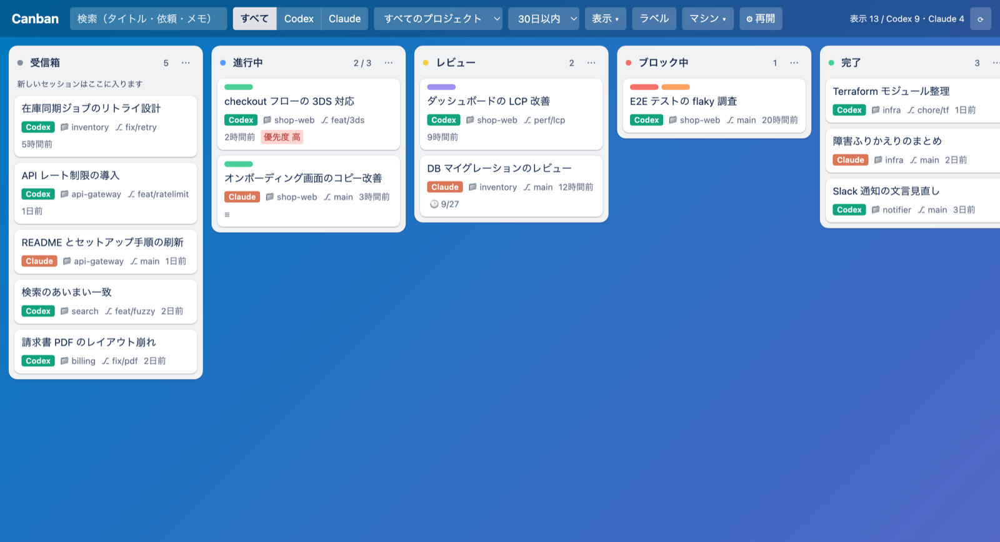

# Canban

**Canban** は、Codex と Claude Code のセッションを Trello 風のカンバンで管理するアプリです。**Codex Desktop・Claude Desktop・Chrome**から、同じボードと共有画面設定を使えます。

| 表示するアプリ | 導入するもの | ボードの開き方 |
|---|---|---|
| Codex Desktop | このリポジトリのCodexプラグイン | サイドバー、または「Canbanを開いて」 |
| Claude Desktop | `dist/canban.mcpb` | チャットで「Canbanを開いて」 |
| Chrome | `dist/chrome`フォルダ＋Native Messaging Host | ツールバーのCanbanボタン |

リポジトリ直下の`manifest.json`はClaude用のMCPB manifestです。Chromeには、ビルドで生成される`dist/chrome/manifest.json`（Manifest V3）を使います。



- **このマシン**と、Codex アプリに登録済みの **SSH リモート接続**上のセッションを、ひとつのボードで扱えます。
- **複数のアカウント**のセッションをまとめて表示します。Claude デスクトップや Codex でアカウントを切り替えても、ボードからは消えません。アカウントごとの**使用量**（5 時間枠・週枠）もヘッダに並びます。
- リストは自由に追加・改名・並べ替え・削除できます。カードはドラッグ＆ドロップで移動できます。ラベル・メモ・優先度・期限・WIP 制限にも対応しています。
- カードから**ワンクリックでセッションを再開**できます。再開先は、Codex / Claude のデスクトップアプリか、ターミナル（新規ウィンドウ / 新規タブ / 分割 / 既存ウィンドウ）を選べます。
- ボードは**リアルタイム**に動きます。実行中のカードには、いま何をしているか（`Bash: npm test` など）が出ます。カードを開くと、Codex / Claude アプリと同じように会話・ツールの実行・結果がその場で流れます。
- カードから既存のセッションに**指示（プロンプト）を送れます**。今すぐ送るか、キューに積み、起動時の安全確認を通った依頼を順に送ります。使用中や状態不明の場合は止めて通知します。送信はエージェント公式の CLI で 1 ターンずつ行い、権限はそのセッションの設定をそのまま引き継ぎます。
- Canban がセッションのファイルを**直接書き換えることはありません**。Canban 側の情報は設定されたCanban専用の保存先に保存します。

> English summary: Canban is a Codex desktop sidebar app (also installable in Claude Desktop as an extension, where the board opens inside the conversation) that puts your Codex and Claude Code sessions — local and on SSH hosts registered in Codex — on a Trello-style board. It never writes agent data itself, stores its own state in its configured data directory, and can resume any session in the agent's desktop app or in your terminal (new window / tab / split / current window). It can also send a prompt (now or queued) to an existing session: one headless turn through the agent's own CLI (`codex exec resume` / `claude -p --resume`), with the session's own sandbox / permission mode. Requires Node.js ≥ 22.13.

## 必要なもの

- Codex デスクトップアプリ（サイドバーアプリ／MCP Apps に対応した版）、または Claude デスクトップアプリ（MCP Apps に対応した版）
- Node.js 22.13 以上（`node:sqlite` を使います。外部依存はありません）
- 任意: Claude Code（CLI）と Claude デスクトップアプリ
- 任意（リモート）: SSH の鍵認証で接続できること、リモート側に `python3` があること

## インストール

1. リポジトリを `~/Documents/repo/canban` に置きます。

   ```bash
   git clone --branch production https://github.com/kamihicouki/canban.git ~/Documents/repo/canban
   ```

2. 個人マーケットプレイス `~/.agents/plugins/marketplace.json` に登録します（ファイルが無ければ作成します）。

   ```json
   {
     "name": "personal",
     "interface": { "displayName": "Personal" },
     "plugins": [
       {
         "name": "canban",
         "source": { "source": "local", "path": "./plugins/canban" },
         "policy": { "installation": "AVAILABLE", "authentication": "ON_INSTALL" },
         "category": "Productivity"
       }
     ]
   }
   ```

3. インストールします。Codex アプリの「プラグイン」画面から入れるか、CLI で次を実行します。

   ```bash
   codex plugin add canban@personal
   ```

4. Codex アプリを再起動します。Explore に出てくる **Canban** をサイドバーにピン留めします。
   チャットで「Canban を開いて」と頼んでも開けます。

### Claude デスクトップで使う

Claude デスクトップには、拡張機能（`.mcpb`）として入れます。

1. 拡張機能のファイルを作ります（`dist/canban.mcpb` ができます）。

   ```bash
   cd ~/Documents/repo/canban
   npm run pack:mcpb
   ```

2. `dist/canban.mcpb` をダブルクリックするか、Claude デスクトップの「設定」→「拡張機能」にドラッグしてインストールします。
   - Node.js 22.13 以上は、PATH・Homebrew・nvm の順に探します。見つからないときは、拡張機能の設定の「Node.js の場所」で指定します。
3. チャットで「Canban を開いて」と頼むと、会話の中にボードが開きます。ヘッダーの ⤢ で全画面にできます。
   - Claude デスクトップには Codex のようなサイドバーの入口がないため、開くときは毎回チャットから頼みます。
   - 「レビュー待ちのセッションを一覧にして」のように、ボードを開かずにツールだけ使うこともできます。

拡張機能を使わない場合は、`claude_desktop_config.json`（macOS では `~/Library/Application Support/Claude/claude_desktop_config.json`）に直接登録しても動きます。

```json
{
  "mcpServers": {
    "canban": {
      "command": "/bin/sh",
      "args": ["/Users/<あなたのユーザー名>/plugins/canban/scripts/launch.sh"]
    }
  }
}
```

Codex と Claude デスクトップの両方に入れた場合も、保存先を同じCanbanデータディレクトリに揃えることで、同じボードが見えます。背景処理（自動化・索引作成・指示のキュー）は、SQLite の実行権を取得したサーバーだけが実行します。

### Chrome で使う

安定版は [Chrome Web Store](https://chromewebstore.google.com/detail/canban/kmnkdbmckholannmfhjfmceofmjdbndh) からインストールできます。ローカル連携ソフトはこのリポジトリの `production` から導入し、`npm run install:chrome-native-host -- --extension-id kmnkdbmckholannmfhjfmceofmjdbndh` で登録してください。macOS／Linux と Node.js 22.13 以上が必要です。以下は開発用の unpacked 拡張を読み込む手順です。

1. このリポジトリで拡張をビルドします。

   ```bash
   cd ~/Documents/repo/canban
   npm run build:chrome
   ```

2. Chrome で `chrome://extensions` を開き、「デベロッパー モード」を有効にして「パッケージ化されていない拡張機能を読み込む」から `dist/chrome` を選びます。表示された拡張 ID をコピーします。
   **リポジトリ直下を選ばないでください。** `Invalid value for manifest_version` と表示された場合は、「キャンセル」で戻り、`dist/chrome`フォルダを選び直します。「再読み込み」では選択済みのフォルダは変わりません。

3. 同じリポジトリから Native Messaging Host を登録します。`<拡張ID>` は手順 2 で表示された 32 文字の ID に置き換えます。

   ```bash
   npm run install:chrome-native-host -- --extension-id <拡張ID>
   ```

   登録するのはユーザー領域の Chrome Native Messaging Hosts マニフェスト 1 ファイルです。マニフェストはこのリポジトリ内の起動スクリプトを指し、接続を許可する拡張 ID を指定します。リポジトリを別の場所へ移動した場合は、再ビルドして Native Messaging Host を再登録してください。
4. Chrome を再起動し、拡張をツールバーにピン留めしてボタンを押すと、Canban が専用タブで開きます。

`Specified native messaging host not found` が表示された場合は、拡張の読み込みは成功していますが、手順3のホスト登録が未完了です。Chromeの拡張画面に表示されるIDで登録コマンドを実行し、Canbanのタブを再読み込みしてください。Codex／Claude／Chromeは同時に開けます。画面設定を同時に変更した場合は、競合を検知した画面の同期を止めます。 更新時は、既に動いているCodex／ClaudeのCanbanサーバーも再起動してください。旧版のサーバーは新しい画面設定の保存形式を知らないため、旧版と新版の併用中は共有画面設定が失われることがあります。

登録を解除するときは、同じ拡張 ID を指定します。

```bash
npm run uninstall:chrome-native-host -- --extension-id <拡張ID>
```

Chrome も Codex／Claude と同じ MCP サーバーと保存先の `canban.sqlite` を使います。フィルター、ボード／分析表示、サイドバー、開いているカード、パネル配置、折り畳みレーンなどの画面設定はアプリ間で共有されます。起動時と画面に戻ったときに同期します。スクロール位置、フォーカス、入力途中の文字は共有しません。競合を検知すると自動マージせず、その画面からの保存を止めて「共有状態を読み込む」操作を表示します。

### ローカル開発環境の配置と更新

このMacでは通常repoを `/Users/d/Documents/repo/canban` に集約し、共有データ・ログ・設定・バックアップをGit管理外の `.local/` に置きます。設定済みlocal mainは `npm run update:local` で、Git管理ファイルのみのプラグイン配布物 `dist/codex-plugin`、登録済みChromeテスト版 `dist/chrome`、Codexへの導入を順に更新します。拡張IDとNative Messaging接続先を維持します。

保存先は `CANBAN_DATA_DIR`、checkoutの `.local/config.json`、`~/.canban` の順で決まります。既存インストールは `~/.canban` を継続して使えます。移行済み環境ではこのパスがrepo内のデータへの互換リンクになります。具体的な配置・移行・クライアント間共有・更新完了条件は [ローカル配置の契約](docs/local-layout.md) を参照してください。

## 用語（Codex / Claude Code との対応）

Canban の言葉が Codex / Claude Code の同名の概念と食い違わないように、次のように呼び分けています。

| Canban | 意味 | Codex / Claude Code 側の近い概念 |
|---|---|---|
| **プロジェクト** | Codex のプロジェクト（名前付き、複数フォルダ）。Codex のプロジェクトに入っていないセッションは作業フォルダ名 | Codex のプロジェクト（同じ意味）、Claude Code のプロジェクト（＝作業フォルダ） |
| **フォルダ** | 作業フォルダの名前（cwd の末尾） | 同じ |
| **カテゴリ** | Canban だけのまとまり。1 枚のカードに 1 つ（API 上の名前は `directory`）。サイドバーの「⇣ Codex」で Codex のプロジェクトから作れます | 近いもの: Codex のプロジェクト、Claude デスクトップのグループ（Canban からは読みません） |
| **ラベル** | 複数付けられるタグ | なし |
| **リスト** | カンバンの列 | 近いもの: Codex のセクション（サイドバーの見出し）。カードに「§ 名前」と表示し、絞り込み・スイムレーンにも使えます。「⚡ 自動化」の「Codex のセクション『…』に入ったら」で、セクションの移動に合わせてリストを動かせます |
| **⚡ 自動化** | 状態・アーカイブ・PR・CI・Codex のセクションの変化でカードを別のリストへ移す。各ルールの「今すぐ実行」で現在の条件に再適用できる | 別物: Codex の**オートメーション**（定期実行されるスレッド。カードには「⏰ Codex オートメーション」と表示）、Codex の `.rules` / Claude の許可ルール（コマンドの実行許可） |
| **タスクカード** | 仕事の情報・通常セッション・保存した作業画面を束ねるカード | 別物: Claude Code の Task / TaskCreate、Codex のクラウドタスク |
| **AI Apps** | Codex / Claude Code のどちらのセッションか | — |
| **📌** | Codex アプリでピン留めしたスレッド（「表示」→ ピン留めしたものだけ） | Codex のピン留め（同じ） |
| **エージェント / サブエージェント** | Codex / Claude Code と同じ意味 | 同じ |
| **作業ディレクトリ** | セッションの cwd | 同じ |

## 使い方

### 再開の経路とショートカット

ヘッダの「⚙ 再開」で既定の動作を変えられます。設定できるのは、デスクトップアプリで開くかターミナルで開くか、使うターミナル、開き方の 3 つです。

| 操作 | 動作 |
|---|---|
| ▶（カード右上）／ 詳細の「再開」ボタン | 既定の方法で再開 |
| ⌥ + クリック | デスクトップアプリとターミナルを入れ替えて再開 |
| ⇧ + クリック | ターミナルの新規ウィンドウで再開 |
| ⌘ + クリック | ターミナルの新規タブで再開 |
| ⌃ + クリック | ターミナルの既存ウィンドウで再開 |
| カード選択中に `o` / `d` / `t` | 既定 / デスクトップアプリ / ターミナル |
| カード選択中に `w` / `n` / `s` / `e` | 新規ウィンドウ / 新規タブ / 分割 / 既存ウィンドウ |
| カード選択中に ← / → | 隣のリストへ移動 |
| カード選択中に ↑ / ↓、Home / End | リスト内で上下に移動、先頭 / 末尾へ移動 |
| ⌥ + 矢印 | カードを動かさずにフォーカスだけ移動 |

AI App（Codex / Claude Code）ごとに、次のリンクやコマンドで再開します。

- **Codex**: `codex://threads/<id>` で開きます。リモートのセッションは `?hostId=<接続ID>` を付けて、手元の Codex アプリから開きます。ターミナルでは `codex resume <id>` を実行します。
- **Claude Code**:
  - Claude デスクトップのセッション情報（`~/Library/Application Support/Claude/claude-code-sessions`）がディスクにあるセッションは、`claude://code/continue?session=local_…` で開きます。最近の Claude デスクトップはこの情報をディスクに置かないことが多いので、その場合、Canban はアーカイブ状態を「不明」と表示します。セッションを始めたアプリ（デスクトップか CLI か）は transcript の `entrypoint` から判断します。
  - CLI だけで使ったセッションは `claude://resume?session=<id>` で開きます。Claude デスクトップがそのセッションを取り込んで、続きから表示します（取り込みは Claude アプリ側の処理で、Canban はデータに触れません）。
  - Claude の設定で OS からの起動（エントリポイント）が無効になっていると、リンクは無視されます。
- **リモート**: ターミナルで `ssh -t <alias> 'cd <cwd>; <再開コマンド>'` を実行します。
- **対応ターミナル**: Ghostty（1.3 以上、AppleScript 対応版）、Terminal.app、iTerm2。
  - Terminal.app の「新規タブ」は、System Events の操作許可（アクセシビリティ）が必要です。
  - 対応していない開き方を選んだ場合は、新規ウィンドウで開きます。

### キーボード操作

`?` キーで一覧を表示します。入力中やダイアログ表示中は無効です。

| キー | 動作 |
|---|---|
| `/` | 検索欄にフォーカス（`Esc` でクリア、`↓` / `Enter` で最初のカードへ） |
| ⌘K / Ctrl+K | コマンドパレット：カード・ビュー・レーン・カテゴリ・プロジェクト・ラベル・操作をまとめて検索して実行 |
| `p` | カテゴリ・プロジェクトで絞り込み |
| `b` | サイドバーの開閉 |
| `[` / `]` | 前 / 次のスイムレーンへ移動 |
| `c` | カードを追加 |
| `a` / `r` | 分析とボードの切り替え / 再読み込み |
| カード選択中に `l` / `g` / `m` / `h` | ラベル / カテゴリ / リストへ移動 / 隠す |

リスト・ラベル・カテゴリ・マシン・タスクカードなどを選ぶ場面では、どれもキーワードで絞り込めるピッカーが開きます。スペース区切りの語はすべてを含む項目に一致し、大文字小文字・全角半角・カタカナとひらがなは区別しません。`↑↓` と `Enter` で選び、ラベルやカテゴリは一致するものがなければその場で作成できます。

### カテゴリ

カテゴリは、セッションやタスクカードを 1 枚につき 1 つだけ入れておく Canban 独自のまとまりです（ラベルはタグとして複数付けられますが、カテゴリは 1 カードにつき 1 つです）。

- カードには 📂 カテゴリ名が、プロジェクト名の代わりに表示されます。
- 作成：サイドバーの「＋ 新しいカテゴリ」、またはカテゴリのピッカーで名前を入力します。
- 所属させる：次のどれかで行います。
  - カード選択中に `g` を押す
  - 詳細の「📂 カテゴリ」から選ぶ
  - カードをサイドバーのカテゴリへドラッグする
  - カテゴリのスイムレーン間でカードをドラッグする
- 自動所属：カテゴリにフォルダを登録すると、その配下で動いたセッションが自動で入ります。サイドバーの ⋯、またはピッカーの「このフォルダのセッションも自動で含める」から登録します。手動で入れたものが優先され、「カテゴリなし」を選ぶと自動所属から外れます。
- 絞り込み・スイムレーン・分析・保存ビュー・MCP ツール（`directory` 引数）でも使えます。

### タスクカードと保存される作業画面

全画面の「＋ タスク」、各列・レーンの追加ボタン、`c` キー、コマンドパレットから、セッションに紐づかない**タスクカード**を作れます。折り畳んだレーンや空のレーンからも追加できます。

- 選択中のカテゴリ・プロジェクト・フォルダ・ラベル・AI App・マシン・アカウント・セクションを変更可能な初期値として引き継ぎます。追加元の列・レーンの指定を優先します。
- Enterで作成するとタイトルだけ空になり、属性を維持して連続作成できます。日本語変換中のEnterでは作成しません。「作成して開く」で詳細を開けます。
- 検索語や実行状態は新規タスクへコピーしません。表示条件は維持し、条件から外れた場合も完了通知の「カードを開く」から確認できます。
- 入力中の内容は画面更新や保存失敗で失われません。通信の再試行は同じ作成リクエストとして扱い、カードの二重作成を防ぎます。
- タスク詳細の「所属を変更」で分類属性を編集できます。アカウント・セクションの指定だけではログイン切替や外部アプリの変更は行いません。

- タスクカードの詳細で、AI App（Codex / Claude Code）・マシン・作業フォルダ・依頼文を選び、新しいセッションを開始できます。
  - 開始先は、デスクトップアプリ（`codex://threads/new?prompt=&path=`、`claude://code/new?q=&folder=`、リモートは `ssh_host` / `ssh_folder`）またはターミナルです。
- 開始したセッションは、AI App・マシン・フォルダ・依頼文の書き出しが一致すると、**自動でカードに紐付き**ます。
- 既存のセッションカードを**タスクカードの上にドラッグ**しても紐付けられます。セッションの詳細にある「タスクカード」欄からも紐付けられます。
- タスクを開くと、親タスクと関連する通常のセッションをカードダッシュボードで表示します。A（左右）・B（上下）・C（並列）・自由配置を切り替え、表示方式、順序、サイズ、付箋、部品配置・高さ・列幅、選択中の会話をタスクごとに保存します。
- 関連会話は一覧で切り替えられます。C・自由配置のライブ表示は親を含め最大8枚とし、関連が多い場合はページを切り替えて全件にアクセスできます。
- 子カードを閉じる操作は表示だけを閉じます。関連は残り、一覧から再表示できます。紐付けと「タスクから外す」は専用の明示的な操作です。
- タスクの説明・メモから、新規セッションや選択した既存会話への依頼文を編集可能な形で作れます。送信時の実行状態・権限の確認は既存の仕組みを使います。
- 一般ダッシュボードと各タスクの構成は独立しています。タスクや表示方式を切り替えても下書きを保持します。下書きは同じページ内で保持し、画面設定の共有には含めません。
- 保存競合は上書きせず通知します。「保存された配置を読み込む」で最新の配置に戻しても、入力途中の文章は保持します。
- 紐付いたセッションの状態が変わると、自動化ではタスクカードのほうが動きます。
- Codex のサブエージェントは、親カードに「🤖 件数」として表示し、詳細で一覧できます。

### 実行状態と自動化

カードに、セッションの実行状態が色付きの点で表示されます。

| 状態 | 表示 | 判定のしかた |
|---|---|---|
| 実行中 | 青（点滅） | ターンの途中。15 分間書き込みが無ければ「待機」に戻す |
| 入力待ち | 橙 | エージェントが質問して回答を待っている（`request_user_input` / `AskUserQuestion` など） |
| 完了 | 緑 | 直近のターンが終わった |
| 中断 | 赤 | ターンが中断された |

- 判定するのは、24 時間以内に更新されたセッションだけです。ログの末尾を読み取り専用で読んで判定します。
- ヘッダの集計ボタンを押すと、その状態のカードだけを表示します。
- 前回見たあとに動きがあったカードには「新着」を付けます。「✓ 既読」でまとめて消せます。
- 「⚡ 自動化」では「完了したら 進行中 → レビュー」のような、カードの自動移動を設定できます。初期状態はすべてオフです。
  - 自動化が自動で動くのは、状態が**変わった瞬間**だけです。
  - 「アーカイブされたら」「どのリストでも → アーカイブ」のルールで、セッションをアーカイブしたときにカードを指定のリストへ移せます。同時に活動や実行状態も変わった場合、アーカイブのルールを優先します。
  - 各ルールの「今すぐ実行」は、画面の絞り込みに関係なく、現在の条件と移動元に一致するカードへ再適用します。無効にしたルールも実行でき、すでにアーカイブ済みのカードの整理にも使えます。「新しい活動があったら」の手動実行は、取得したすべてのセッションが対象です。
  - アーカイブ済みのカードを確認するには、表示設定でアーカイブ済みを含めてください。Claude のアーカイブ状態が不明なセッションは、アーカイブのルールの対象にしません。
  - Codex が起動していれば、ボードを閉じていても 60 秒ごとに評価します。
  - 自動で動いたカードには ⚡ が付き、直後のお知らせから元に戻せます。
  - 直前の状態は、Canban 専用の 保存先の `canban.sqlite` に保存します。手動実行では、この状態を変更しません。

### カードの表示（複数のパネル）

カードを開くと、詳細は画面の上に「パネル」として重なります。カードは 8 枚まで同時に開いておけ、付箋のように置いたり、並べたりできます。パネルは画面の高さを超えず、はみ出す部分は各カラムの中でスクロールします。

- **全体設定と個別設定**: パネルの上のバーで決めた「空間・並べ方・表示・サイズ」が全パネルの既定です。各パネルは既定に従い（初期状態）、パネル自身のボタン（空間ボタン・表示メニュー）で個別に上書きできます。「全体設定に従う」で戻せます。
- **空間**: 固定は整列して置かれ（グリッド / 横一列 / 縦一列、中央寄せ）、タイトルのドラッグで順序を入れ替えます。自由は好きな場所へドラッグでき、画面の端や他のパネルにくっつきます。幅 720px 未満では縦に積みます。
- **表示**: テキスト（装飾を抑えた等幅寄りの表示）/ プレビュー（従来どおり）/ 要点（ツール実行と思考を隠し、返答は 3 行まで）。サイズは S / M / L。
- **付箋にたたむ**: タイトルと「いま何をしているか」の 1 行だけにします。バーの「すべて付箋に」「すべて広げる」で一括操作できます。
- **部品の並び替え**: 会話・指示・ラベル・メモ・計画・編集ファイル・モデルと権限・再開などは、グリップのドラッグ（または `↑` `↓`）で並べ替えます。2 カラム構成は変わらず、同じカラムの中だけ動かせます。並びは全パネル共通で、「部品の並びを初期化」で戻せます。
- **ダッシュボードボタン**: 開いているパネルすべてを、丸いボタン 1 つに畳めます（`D` キー、またはボタンを押す）。ボタンの縁には各カードの状態（実行中・入力待ち・完了）の割合、角には枚数が出ます。触れるとカードのアイコンが扇状に広がり、選んで開けます。畳んでいる間にボードのカードを押すと、開かずにダッシュボードへ足すだけです（バーの「畳んだまま足す」で切り替え）。
- **ボタンの置き場所**: ボタンをドラッグすると、いちばん近い画面の辺に吸着します（`Shift` + 矢印キーでも動かせます）。扇は内側へ開き、位置は次回も覚えています。
- **背景と階層**: ダッシュボードが開いている間は、固定・自由を問わず背景を暗くします。メニューなどを重ねると、もう一枚透過の暗幕が重なります。画面左下（ボタンが左下にあるときは右下）の階層メーターが、ホーム・ダッシュボード・メニューのどこにいるかを示します。
- 開いているパネルと設定・位置は、このアプリの UI に記憶されます（Codex と Claude デスクトップでは別々です）。

### リアルタイム表示

ボードを開いている間、Canban はセッションのログと自分の保存ファイルを監視し、変化があった分だけを画面に反映します。

- **カード**: ログが伸びたセッションのカードだけを差し替えます。実行中・入力待ちのカードには、いまの動き（最後のツール呼び出しやメッセージの 1 行目）を表示します。状態が変わったとき（実行中 → 完了など）は、自動化が動くようにボード全体を読み直します。
- **カードの詳細（会話）**（開いているパネルすべてで同時に更新）: ユーザーの依頼、エージェントの返答、考えた内容（折りたたみ）、ツールの実行（実行中はくるくる、終わると ✓ / ✗、クリックで出力の先頭）、ターンの終わりを、エージェントのアプリと同じ順に表示します。最下部までスクロールしていれば新しい行を追いかけ、読み返している間は「↓ 新着」を出します。
- **いまの状態**: ログに書かれている次の情報も、リアルタイムで表示します。
  - **コンテキスト**: 直前の返答の時点で使っているトークン数です。Codex は上限に対する割合、Claude は上限が分かるときだけ割合を出します。カードの `◔ 62%` がこれです。完了したカードでも 75% を超えるとオレンジ、90% を超えると赤で出ます。
  - **計画**: Claude の TodoWrite や Codex の update_plan の進み具合です（`☑ 3/7`）。詳細では各項目と、いま取り組んでいる項目を表示します。
  - **このターンで編集したファイル**: Edit / Write / apply_patch / FileChange から数えます（`✎ 4`）。
  - **動作中のサブエージェント**（Claude の Task / Agent）の数（`🤖 2`）。
  - **入力待ちの理由**: 質問への回答待ち（❓）か、計画の承認待ち（📋）か。
  - **モデル・effort・権限モード**（Claude の permission mode、Codex の sandbox）。
  - **利用上限（アカウントごと）**: 5 時間枠・週枠の使用率を、アカウントごとにヘッダに表示します（[アカウント](#アカウントと使用量)）。マウスを乗せると、リセットまでの時間が分かります。
- **Git の状態**: 実行中のセッションのフォルダについて、ブランチ、コミットしていない変更の数、追跡していないファイルの数、リモートとの差（↑ 進み / ↓ 遅れ）をカードに出します（`⎇ main ±3 ↑1`）。コミットやチェックアウトをすると、すぐに変わります。カードの詳細では、実行中でなくても開いた時点の状態を出します。
  - `git --no-optional-locks status` で読むだけです。リポジトリのファイル（index など）は書き換えません。
  - ブランチの切り替えやコミットは `.git` の HEAD / index の変化で検知します。まだ git add していない編集は、ログが伸びたときに最大 10 秒ごとに数え直します。
- **Claude デスクトップでの変更**: Claude デスクトップでセッションの名前を変えたり、アーカイブしたり、状態が変わったりすると、すぐにボードへ反映します。アプリが活動記録のためだけに書き換えたときは、ボードを読み直しません。
- **共同作業**: Codex と Claude デスクトップの両方でボードを開いていると、片方でカードを動かすともう片方にもすぐ反映されます。
  - ほかのアプリでボードを開いていると、ヘッダに「👁 Claude デスクトップ」のように出ます。相手がカードの詳細を開いていると、そのカードに 👁 が付きます（自分の詳細画面にも「〜でも開いています」と出ます）。
  - ボードごとに `canban.sqlite` の在席テーブル へ 30 秒おきに印を残し、90 秒更新がなければ消えます（ボードを閉じたり、画面が隠れたりしたとき）。ボードデータ の書き込みはプロセス間でロックするので、同時に操作しても更新が消えません。
- 1 行ずつの更新です。Codex / Claude はトークン単位の途中経過をログに書かないため、文章は段落（ログの 1 行）ごとに現れます。
- リモート（SSH）のセッションは監視できないため、これまでどおり定期的に読み直します。

**負荷を抑えるしくみ**

- MCP Apps の UI はツール呼び出しでしかサーバーと話せないため、UI は `canban_watch` を 1 本だけ開いたままにします（ロングポーリング、最大 20 秒）。何も起きなければ 20 秒に 1 回の呼び出しだけで、その間サーバーは何もしません。
- 監視は OS のファイル通知（`fs.watch`）です。ボードを閉じると 60 秒後に監視をやめます。Codex が会話ごとに起動するほかのサーバーは、ボードを開かない限り何も監視しません。
- ログは前回読んだ位置から追記分だけを読みます。「いまの状態」も、ログごとに前回までの集計を持ち、追記分だけを足していきます。カードの差し替えは、変わったセッションのログ末尾を 1 回読むだけで、セッション一覧は作り直しません。
- ファイル通知が使えない環境では、監視対象のファイルだけを 2 秒ごとに `stat` します。
- ホストがアプリのツール呼び出しを 1 本ずつしか通さない場合は、クリック操作が待たされないよう、自動で 2.5 秒ごとの短い問い合わせに切り替えます。
- `CANBAN_LIVE=0` でリアルタイム表示を止め、以前の定期読み直し（15〜60 秒）に戻せます。

### Git / PR 連携（GitHub・GitLab）

- **リポジトリの特定**: Codex が記録している `git_origin_url`、Claude の PR リンク、作業フォルダの `remote.origin.url`（読み取りのみ）から、セッションのリポジトリを特定します。
- **PR / MR の取得**: GitHub は `gh`、GitLab（gitlab.com）は `glab` を使います。どちらもログイン済みであることが前提です。
  - リポジトリごとに一覧を取得して 5 分キャッシュし、一覧に無い古いブランチはブランチ名で個別に問い合わせます。
  - GitLab のパイプライン状態は、オープン中の MR についてだけ取得します。
- **カード表示**: PR / MR 番号を状態色（オープン・ドラフト・マージ済み・クローズ）で表示し、CI の結果（✓ / ✗ / ●）も付けます。クリックすると PR / MR が開きます。
- **自動化**: 「PR / MR がマージされたら → 完了」「CI が失敗したら → レビュー」のような自動移動ができます。
- **同じブランチのまとめ**: 詳細画面に同じブランチのセッションを表示します。「表示」メニューの「同じリポジトリ＋ブランチのセッションをまとめる」を選ぶと、ボード上で 1 枚にまとめます。
- `gh` / `glab` が無い、または未ログインの場合、この機能は静かに無効になります。理由は「⚡ 自動化」の画面に表示されます。

### 分析・全文検索・スイムレーン・保存ビュー

- **📊 分析**: 日別のセッション数（Codex / Claude の積み上げ）、トークン量、プロジェクト別とマシン別の内訳、リストの滞留時間、最後のリストに届くまでのサイクルタイムと週ごとの完了数を表示します。
  - ヘッダの絞り込み（AI Apps・マシン・カテゴリ・プロジェクト）がそのまま効きます。カテゴリ別の内訳も表示します。
  - 各グラフはホバーで数値を確認でき、「表で見る」で表形式にも切り替えられます。
- **本文検索**: 検索欄の横の「本文」をオンにすると、会話の本文も検索します（3 文字以上、日本語の部分一致に対応）。
  - 直近 90 日のセッションを Canban 専用の索引 保存先の `search.sqlite`（SQLite FTS5 trigram）にバックグラウンドで取り込み、カードに一致箇所を表示します。
  - 有効にしたリモートのホストでは、その場で検索します。
- **スイムレーン**: 「表示」メニューで、行をカテゴリ・プロジェクト・マシン・AI App・ラベルごとに分けられます。
  - レーンの見出しはスクロールしても上に残ります。
  - レーン内のリストの高さは「コンパクト / 標準 / すべて」から選べます。
  - たたんだレーンにも、リストごとの件数が表示されます。
  - 左のサイドバーから各レーンへ移動できます。⌥ + クリックか「◎ これだけ」で、そのレーンだけを表示します。すべて展開 / すべてたたむ もサイドバーから行えます。
- **保存ビュー**: 「ビュー」メニューで、今の絞り込み・検索・スイムレーン・表示オプションを名前を付けて保存できます。`1`〜`9` キーで切り替えられます。

### セッションに指示を送る

セッションの詳細の下にある「指示を送る」から、既存のセッションにプロンプトを送れます。

- **今すぐ送信**: その場で 1 ターン実行します。**キューに追加**: 起動時の安全確認を通れば、積んだ順に 1 件ずつ送ります。使用中・状態不明の場合はキューを停止して通知します。
- 送信は、Codex / Claude Code 公式の CLI をヘッドレスで再開して行います（Codex は `codex exec resume <id> -`、Claude Code は `claude -p --resume <id>`）。プロンプトは標準入力で渡し、コマンドライン引数やシェル文字列には載せません。結果（最終メッセージの先頭）は履歴に残り、会話そのものはいつもどおりボードから読めます。
- **権限はそのセッションの設定を引き継ぎ、引き上げません。** Codex は最新ターンのサンドボックス（read-only / workspace-write / danger-full-access）で実行し、承認が必要な操作は失敗させます（ヘッドレスでは答えられないため）。Claude Code は最新の `permissionMode` で実行します。ワークスペースの設定（`.claude/settings*.json` など）は CLI 自身が読み込みます。
- 制限なし（`danger-full-access` / `bypassPermissions`）のセッションは ⚠ で表示し、送るたびに確認が必要です。
- 次の場合は送りません。
  - セッションが実行中か、入力待ちのとき。
  - ログが更新されてから 20 秒たっていないとき。
  - 画面を開いたあとにセッションが更新されたとき（最新を確認してから送ります）。
  - サブエージェントやアーカイブ済みのセッション。
  - 同じセッションで別の指示が実行中のとき。
  - Codex アプリ側のキューに、そのスレッドへのフォローアップが待機しているとき（二重に送らないため。カードに「⏭ Codex キュー」と表示します）。
- 失敗・停止したら、そのセッションのキューは一時停止します。勝手に次を流しません。待機中の指示は編集・並べ替え・取り消しでき、実行中のものは停止できます。
- Codex / Claude アプリでそのセッションを開いたまま送ると、アプリ側の表示と履歴がずれることがあります。閉じてから送ってください。
- エージェント（モデル）からは `canban_send_prompt` で送れます。モデルからの送信は、セッションあたり 1 時間 10 件までに制限しています。制限なしのセッションにはモデルからは送れません。どちらも「⚙ 設定」で変えられます。
- リモートのセッションにも、同じ仕組みで ssh 経由で送れます（[server/remote/dispatch.py](server/remote/dispatch.py)）。

### 動作の重さ

Canban は自分自身の処理時間を計測し、予算（[docs/performance.md](docs/performance.md)）を超えるとヘッダに「⚠ 遅い処理」を表示します。クリックすると、処理ごとの p50 / p95 とイベントループ遅延、メモリを確認できます。

- Codex は会話ごとに Canban のサーバーを起動するため、多数のサーバーが同時に動きます。そのため、背景処理（自動化・本文検索の索引作成・指示のキュー）は、選ばれた 1 つのサーバーだけが実行します。
- Codex のセッション一覧は差分で読み込みます。変化がなければ、データベースには問い合わせません。

### アカウントと使用量

ヘッダのアカウントボタンに、使用量が二重リングで並びます（外側が5時間枠、内側が週枠）。押すと各アカウントのログイン状態、使用量、最終取得時刻を確認できます。名前をクリックするとカードを絞り込み、チェックでリングの表示を切り替えます。設定ボタンから表示名・頭文字・色を変更できます。

**使用量の更新**: アカウントごとの「更新」または「すべて更新」で現在の使用量を取得します。自動更新は既定5分で、1〜1440分の任意の間隔を保存できます。Canbanの連携プロセスが稼働している間に更新し、次の取得までの時間も表示します。複数の画面や連携プロセスがあっても、同じアカウントへの同時取得を抑制します。

- Codexは対象の `CODEX_HOME` に保存された認証情報で公式CLIのApp Serverから利用上限を取得します。モデルへの指示や有料のターンは実行しません。APIキーのアカウントはサブスクリプション使用量の取得対象外です。
- Claudeは対象のCLI保存先のOAuth認証で公式の使用量APIから取得します。認証切れやデスクトップのみのアカウントには「ログインして最新の使用量を取得」を表示します。取得したアカウントIDを照合して別アカウントの値を混ぜません。
- セッションログやClaude Desktopの記録も表示に使用します。取得失敗時は前回の値と時刻を残し、更新状態を別に表示します。未取得・期限切れを残量100%として表示しません。

**追加**: サービスを選び「ターミナルでログイン」または「任意のブラウザで認証」を選びます。保存先の `accounts/<service>/<id>/`に専用の保存先を作成します。ブラウザ認証ではURLをコピーして好きなブラウザで開くか、Chromeのプロファイル／Safariを選んで起動できます。Claudeはブラウザに表示された認証コードも入力できます。ターミナルを開けない場合は、ログイン待ちの「ログインコマンドをコピー」から任意のターミナルで実行してください。ディレクトリ入力は不要です。ログイン完了は自動確認し、「完了を確認」からも確認できます。既存の認証情報は上書きしません。ログイン待ちは再起動後も残り、取消時にもファイルは削除しません。ブラウザ認証とターミナル起動は現在macOS対応です。

**保存先の変更**: Canbanで追加した専用保存先は、アカウント設定から同じディスク内の未使用フォルダへデータごと移動できます。実行中・入力待ちのセッションがある間は変更できません。Claudeの認証は移動先でCLIが読める `.credentials.json`（本人のみ読み書き可能）にも保存します。既定の `~/.codex` や `~/.claude` は移動しません。既存フォルダの登録・解除、自動検出は「詳細設定」から操作できます。別のフォルダのセッションを再開・送信するときは、その `CODEX_HOME` / `CLAUDE_CONFIG_DIR` を使用します。

モデルからは `canban_get_usage` でアカウントと使用量を参照できます。更新・ログイン・保存先の変更はUI用の操作です。

### リモートのセッション

ヘッダの「マシン」に、Codex アプリに登録済みのリモート接続が並びます（`~/.codex/.codex-global-state.json` から読み取り専用で取得します）。

- 読み込むホストを個別にオンにします。初期状態はすべてオフです。
- オンにしたホストには `ssh -o BatchMode=yes <alias> python3 -` で接続し、同梱の読み取り専用スクリプト（[server/remote/collect.py](server/remote/collect.py)）を実行します。
- 結果は 60 秒キャッシュします。応答しないホストがあってもボードは待たされず、エラーとして表示されます。
- ホスト名をクリックすると、そのマシンのセッションだけを表示します。

## データと安全性

| 対象 | 扱い |
|---|---|
| `~/.codex/state_*.sqlite`、`~/.codex/sessions/**` | Canban は読み取り専用（SQLite の read-only モード＋`PRAGMA query_only`）。指示を送ったときは、Codex 自身（`codex exec resume`）がセッションに 1 ターン追記します |
| `~/.claude/projects/**`、Claude デスクトップのセッション情報 | Canban は読み取り専用。指示を送ったときは、Claude Code 自身（`claude -p --resume`）が追記します |
| アカウント情報（`~/.claude.json`・各設定フォルダの `.claude.json`、Codex の `auth.json`、Claude デスクトップの `config.json`・`plan-usage-history.json`） | 読み取り専用。アカウント 表示にはID・メールアドレス・プラン・使用率だけを使います。使用量取得では認証情報を公式サービスへ渡しますが、CanbanのDB・返却値・ログには保存・出力しません |
| Canbanデータディレクトリ内の `canban.sqlite`（WAL を含む）、`search.sqlite`、`runs/*.log` | Canban が書き込むファイル（Canban 専用のディレクトリ） |

詳しくは [SECURITY.md](SECURITY.md) を参照してください。

## しくみ

- Codex の MCP サーバーとして動く **MCP App** です。`open_canban` ツールの `_meta["openai/ui"]` に `{ "entrypoints": [{ "type": "global" }] }` を宣言すると、Codex の Explore とサイドバーに項目が現れます。
  - **これは Codex アプリの実装を調べて見つけた未公開の仕様**なので、将来の更新で変わる可能性があります。
- Claude デスクトップなど、ほかの MCP Apps 対応アプリでは、同じ `open_canban` の標準の `_meta.ui.resourceUri` を使って会話の中にボードを表示します。拡張機能の定義は `manifest.json`（MCPB）です。
- UI は 1 枚の HTML です（`ui://canban/board.html`、`text/html;profile=mcp-app`）。MCP Apps の postMessage ブリッジを通じて、`canban_*` ツールを呼び出します。

```
server/
  index.mjs            MCP サーバー（stdio / JSON-RPC）
  board.mjs            セッション一覧とカンバン状態を合成
  store.mjs            SQLite Worker を通したボード操作
  live.mjs             ファイル監視（ボードを開いている間だけ）
  watch.mjs            canban_watch: 監視イベントをカードの差分・会話の追記分に変換
  feed.mjs             セッションログを会話の項目に変換し、追記分だけ読む
  agents.mjs           AI App ごとの再開リンク・コマンド・ヘッドレス実行の引数
  launcher.mjs         デスクトップリンクとターミナルの起動
  requests.mjs         指示（依頼）の保存（プロセス間ロック付き）
  dispatch.mjs         送信前の確認・CLI の起動・結果の確定・キュー
  permissions.mjs      セッションの権限の読み取り（引き継ぎのみ）
  leader.mjs           背景処理を担当するサーバーの選出
  perf.mjs             処理時間の計測と予算
  accounts.mjs         アカウント・設定フォルダ・Claude デスクトップのプロファイル・アカウントごとの使用量
  accounts-settings.mjs アカウントの設定（表示名・頭文字と色・ヘッダに出すか・設定フォルダ）の正規化
  accounts-mcp.mjs     アカウントのツール・絞り込み・デスクトップへの注意書き・追加の監視フォルダ
  ui.mjs               ボードの HTML を組み立てる（ui/ の @include を 1 つの <style> / <script> に埋め込む）
  sources/             Codex / Claude / リモート接続の読み取り専用リーダー
  remote/collect.py    リモートで動く収集スクリプト（読み取り専用、Python 標準ライブラリのみ）
  remote/dispatch.py   リモートで指示を送るスクリプト（CLI の起動・確認・停止）
  remote/pool.mjs      SSH の並列実行・キャッシュ・タイムアウト
ui/board.html          ボード UI（ui/header.*・ui/accounts.* を @include で取り込む）
```

## 開発

```bash
npm test          # フィクスチャを使ったテスト（Node.js のテストランナー）
npm run dev       # http://localhost:4517/direct で UI を確認（起動処理と指示の送信は dry-run）
npm run pack:mcpb # Claude デスクトップ用の拡張機能 dist/canban.mcpb を作る（@anthropic-ai/mcpb を npx で取得）
npm run bench     # 実データ（読み取りのみ）で処理時間を計測。--save / --compare で前回と比較、--procs 10 で多重起動時の CPU を確認
```

環境変数:

| 変数 | 用途 |
|---|---|
| `CANBAN_DATA_DIR` | データの保存先 |
| `CANBAN_CODEX_HOME` / `CANBAN_CLAUDE_HOME` / `CANBAN_CLAUDE_DESKTOP_DIR` | 読み取り元の差し替え |
| `CANBAN_SSH` / `CANBAN_GH` / `CANBAN_GLAB` | ssh・gh・glab コマンドの差し替え |
| `CANBAN_LAUNCH_DRYRUN=1` | アプリやターミナルを実際には開かず、指示も実際には送らず、ログだけ出す |
| `CANBAN_CODEX_BIN` / `CANBAN_CLAUDE_BIN` | 指示の送信に使う CLI の差し替え |
| `CANBAN_NODE` | `scripts/launch.sh` が使う Node.js（Claude デスクトップの拡張機能の設定「Node.js の場所」もこれを設定します） |
| `CANBAN_BACKGROUND=0/1` | 背景処理を行わない / 必ず行う（既定はサーバー間で 1 つを選出） |
| `CANBAN_SEARCH_INDEX=0` | 本文検索の索引作成を止める |

Issue や PR を歓迎します。

## ライセンス

[MIT](LICENSE)

## SQLite への移行（0.14.0）

同一端末の Codex Desktop・Claude Desktop・Chrome は 保存先の `canban.sqlite` を共有します。各 MCP プロセスの専用 Worker が DB 操作を行います。WAL によって閲覧を継続でき、書き込みは `BEGIN IMMEDIATE` で直列化します。ロック待ちは 250ms、DB 操作の再試行を含めて最大 2 秒です。取得できなければ「別の画面が更新中」と通知します。Turso による端末間同期は含みません。

1. すべてのアプリの Canban を閉じ、Canban サーバーを停止します。
2. `npm run migrate:sqlite` で停止状態と移行先を事前確認します。
3. `npm run migrate:sqlite -- --apply` で移行します。旧 JSON は権限 0600、バックアップ用ディレクトリは 0700 で保存します。
4. 同じバージョンの Codex プラグイン・Claude MCPB・Chrome 拡張を読み込み直します。Chrome のプロフィールと Native Messaging 登録は維持します。

独立したデータディレクトリには `--data-dir /absolute/path` を指定できます。この場合も対象サーバーを事前に停止してください。プロセスの保存先・起動場所と DB 内の接続情報で停止を確認します。移行済みの DB には JSON を再取り込みせず、移行後は JSON への書き込み・障害時のフォールバックも行いません。実行中の依頼は `interrupted` として保存し、キューを停止します。在席情報と実行権は新しく作成します。

ロールバック用の最新 JSON は、全サーバーを停止して `npm run export:json -- --apply` で書き出します。まず `npm run export:json` で事前確認できます。出力先の `export-*` にある JSON を旧版で使用してください。古いバックアップを戻すと最新の更新が失われるため、使用しません。

### 送信が停止した場合

使用中・状態不明・確認中の更新・外部 CLI の writer 競合は `blocked` として通知し、そのセッションのキューを停止します。履歴の「再送内容を確認」から入力欄へ戻し、状況を確認して明示的に送信してください。入力途中の文字は消しません。

CLI が起動したか、終了したかを確定できない場合は `interrupted` にし、自動再送しません。実行権の期限切れや所有者の終了だけで再取得せず、子プロセスの終了が確認できるまで停止します。PID を保存できなかった要求や接続できないリモートの実行権も保持します。安全な停止を優先するため、こうした不明要求を再送するには実行状況の確認が必要です。DB の実行権を直接削除して解除しないでください。

共有画面設定はリビジョンが一致するときだけ保存します。DB の変更番号を 2 秒おきに確認し、WAL の通知と前面復帰時の読み込みも使います。競合時は入力とローカル設定を維持し、明示的に共有状態を読み込めます。


## 共通ワークスペース（0.15.0）

Codex Desktop・Claude Desktop・Chrome は同じサイドバーと画面状態を使います。ホーム、カード、Agent Usage、分析、各管理ページをサイドバーから切り替えます。「ホームへ戻る」ボタンはありません。

- 固定カードはCanbanの表示領域を上下12pxの余白で使い、内容はカード内でスクロールします。複数行のグリッドは1行320px以上を確保し、収まらない場合はダッシュボードをスクロールします。
- 画面を切り替えても開いたカードと入力途中の内容を保持します。入力中は共有状態の取り込みを保留します。共有の競合は自動マージせず、設定の「共有状態を読み込む」から再取得できます。
- Agent Usage はアカウントの利用上限、セッションのコンテキスト量、接続中の画面を分けて表示します。未取得は数値で表示しません。15分以上古い値やリセット期限を過ぎた値は「要更新」です。
- アカウントの表示名・設定フォルダは「設定 → アカウント」で管理します。独立したフォルダのセッション再開には対応しますが、アカウント間の会話移行やログインの自動切り替えは行いません。

### 開発・統合の担当

Canbanの開発と`origin/main`への統合は、このCodex側を主管とします。他の作業経路での変更はブランチとPRにまとめ、共通UI・SQLite・送信排他への影響をレビューしてから統合します。

### ブランチとリリース（GitLab Flow）

`main` は開発用、`production` は安定版のリリース用です。既定ブランチは `main` のままです。開発する場合は `git clone --branch main https://github.com/kamihicouki/canban.git` を使い、作業ブランチから main に統合します。

リリースは同じリポジトリの **main → production の PR** で行います。production は直接 push・強制更新・削除を禁止し、4構成のテスト、ZIP作成、取り込み元の検証を必須にします。単独で運用できるよう、他者の承認人数は0人です。

production に作られたマージ履歴は main に取り込み、次のリリース PR が production の最新コミットを含む状態で必須チェックを通します。

main と PR では検証と ZIP 作成までを実行します。production の更新では、同じコミットの Ubuntu/macOS × Node 22/24 のテストと ZIP 検証が成功した後、Chrome Web Store へアップロード・審査申請します。タグからの公開は行いません。軽微な修正を含め、変更ごとに `x.y.z` のバージョンを上げ、package・MCP manifest・Codex plugin・Chrome build の番号と CHANGELOG を揃えてください。ローカル main に取り込んだ変更は、Chrome に登録済みの固定フォルダーへ再ビルドしてから拡張を再読み込みします。ストアへのリリース時は公開済みより新しい番号を使用します。緊急修正も main に統合してから production へ取り込みます。

認証設定、手動実行、申請の証拠は [CHROMEWEBSTORE.md](CHROMEWEBSTORE.md) を参照してください。審査申請の成功と実際の公開は別の状態です。
