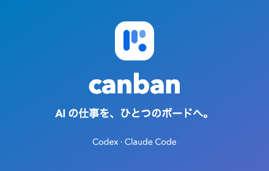
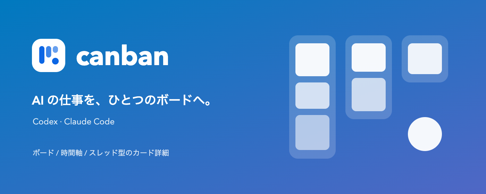
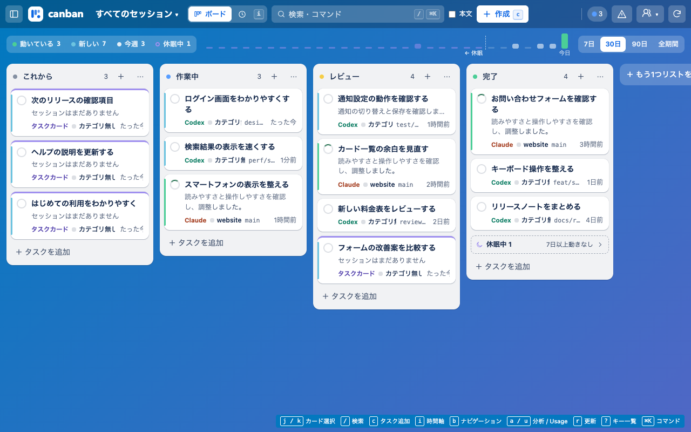

# Chrome Web Store 掲載素材

2026-10-09、素材更新版 0.26.5。画面は origin/main `02b94ecee4284be2f528aab4abb46984c998eaea` のUIを使い、隔離した開発ホストで架空データを表示して撮影したものです。ストア版の実機動作の証拠には使いません。

## アップロードするファイル

| 用途 | ファイル | 寸法 |
|---|---|---|
| ストアアイコン | [icon-128.png](../icons/icon-128.png) | 128×128、96pxのロゴ＋16pxの透過余白 |
| 小タイル | [promo-small.png](promo-small.png) | 440×280 |
| 大型バナー | [promo-marquee.png](promo-marquee.png) | 1400×560 |
| 画面1：ボード | [screenshot-board-light.png](screenshot-board-light.png) | 1280×800 |
| 画面2：時間軸 | [screenshot-timeline.png](screenshot-timeline.png) | 1280×800 |
| 画面3：会話 | [screenshot-conversation.png](screenshot-conversation.png) | 1280×800 |
| 画面4：タスク詳細 | [screenshot-task-detail.png](screenshot-task-detail.png) | 1280×800 |
| 画面5：ダーク | [screenshot-board-dark.png](screenshot-board-dark.png) | 1280×800 |







## ストアへの反映

素材の作成・検証は完了しています。管理画面へのアクセスは以前の安全判定で拒否されているため、掲載画面へのアップロードと保存は未実施です。

対象は [Canban の管理画面](https://chrome.google.com/webstore/devconsole/97689f5d-07e8-4c7c-85d6-465f31dc56d4/kmnkdbmckholannmfhjfmceofmjdbndh/edit) です。既存の「大作」プロファイル・kamihicouki@gmail.com を使用します。

1. ストア掲載情報のグラフィック欄で、アイコン・小タイル・大型バナーを上記PNGへ差し替えます。
2. 旧版の画面画像を削除し、上記「画面1〜5」の順に5枚を登録します。
3. プレビューで画像の切れと表示順を確認し、保存します。管理画面が示す審査・公開手順に従います。
4. 公開ページで新アイコン・タイル・5枚の画像が表示されることを確認します。

配布ZIPは `dist/canban-web-store.zip`、掲載素材一式は `dist/chrome-web-store-listing-0.26.5.zip`。ZIPの公開ワークフローは拡張の配布物を更新するもので、掲載画像のアップロードは別に必要です。

## 再生成

Node.js 22.13以上とChromeを使い、repoのルートで実行します。追加npmパッケージは不要です。

```sh
node scripts/generate-store-assets.mjs
# ロゴと宣伝画像のみ
node scripts/generate-store-assets.mjs --branding-only
```

`CANBAN_BROWSER_EXECUTABLE` でChromeの実行ファイルを指定できます。撮影は一時プロファイルとlocalhostのソースUIだけを使います。Native Messaging、インストール済み拡張、実セッションの保存先には接続しません。

ロゴの形は `ui/icons.js` の `LOGO_SVG`、色は `ui/base.css` のトークンから読み込みます。配布用 `assets/canban.svg` / `assets/canban.png` と3サイズの拡張アイコンも同時に生成します。宣伝画像のSVGは編集用の原稿として保存し、ストアにはPNGをアップロードします。
