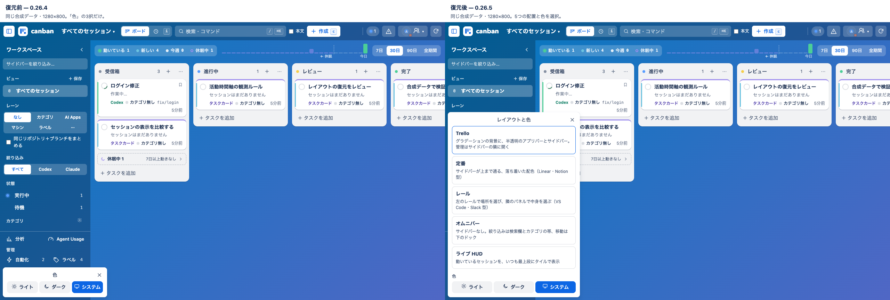
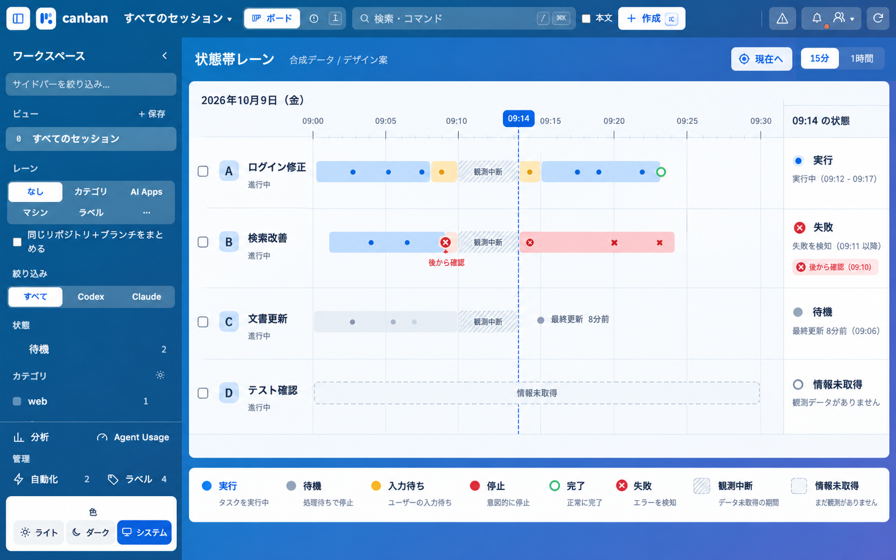
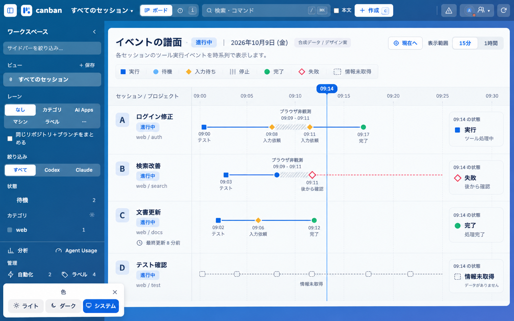
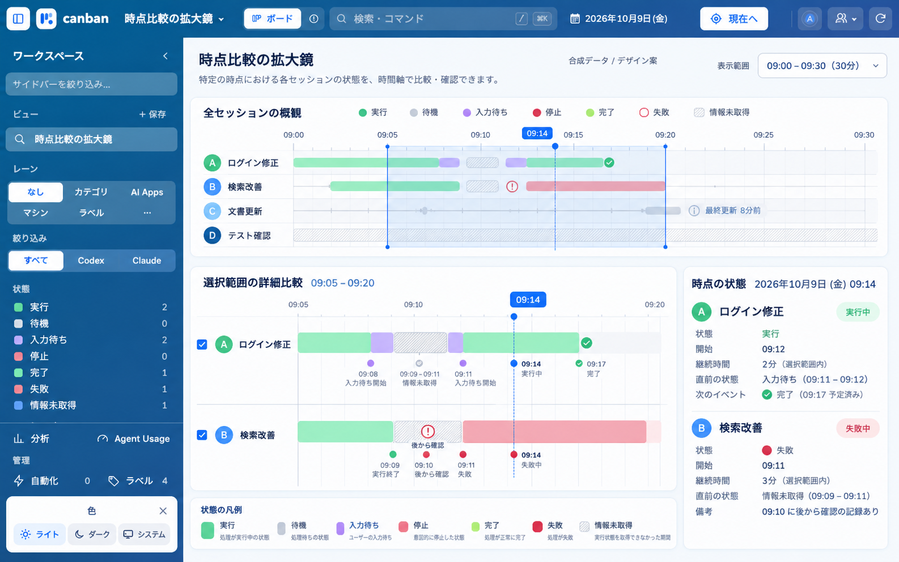

# Canban レイアウト復元・活動時間軸のデザイン案

2026-10-09。専用作業ツリー `codex/restore-layouts`、基点 `b2a7dfb`（0.26.4）。
復元コードは0.26.5。実データの移行、配布物の更新、push、merge、外部公開は行っていない。

## 復元と原因

消失の原因は0.26.0の `02cb555f41531ac5f083baf0e0f0346c0b42e0c3`。
「寿命で整理する1つの見た目」の変更で `ui/layouts.js` / `ui/layouts.css`、選択UIと共有状態の `layout` を明示的に廃止していた。
0.26.4の通常repoと `dist/chrome/manifest.json` に、この廃止が含まれていることを読み取り確認した。

| 復元対象 | ID | 配置 |
|---|---|---|
| Trello | `trello` | 青い背景、共通のアプリバーとサイドバー |
| 定番 | `classic` | サイドバーが上まで通る落ち着いた画面 |
| レール | `rail` | 左の場所選択と、その隣の文脈・管理パネル |
| オムニバー | `omni` | 検索・カテゴリの帯と下のドック |
| ライブ HUD | `hud` | 実行中・入力待ちのカードを最上段で確認 |

入口は各配置の「レイアウトと色」と⌘K。メニューはレイヤー4、⌘Kはレイヤー5。
ボード／既存の時間軸、寿命別のカード密度、時間の帯、カード詳細は共通の部品を使う。
色と配置は独立した共有UI設定に保存する。切替は取得済みカードを再描画するだけで、カードの取得・移動・既読化を呼ばない。共有設定の変更が配置だけの場合も再取得しない。

旧 `layout` 値がローカルまたは共有UI状態に残っていれば再利用する。
未知値はTrelloとして表示し、生の値は明示的な選択まで保持する。共有値の `null` も書き換えない。
0.26.0以降の保存で既に消失した値は、自動復元できない。

通常repoにあった `prototypes/accounts-refresh/` と `ui/task-conversation.prototype.html` はそのまま残っている。
導入済みソース・Chrome配布物は0.26.4のまま。この作業ツリーの0.26.5は未導入。

## 操作できるプレビューと画像

- [復元プレビュー](http://127.0.0.1:4528/direct)：合成のセッションとタスクだけ。専用の一時データ・合成Codex/Claudeホーム、起動操作はdry-run。
- [比較と全20画面・3案のギャラリー](http://127.0.0.1:4531/gallery.html)
- 保存した [比較ページ](comparison.html) / [ギャラリー](gallery.html)。プレビュー停止後も同じフォルダ内の画像を閲覧できる。

変更前は基点のUIを組み立て、変更後と同じ合成バックエンド・1280×800・ライト・ボード・Trello配置で撮影した。
画像の内容を生成・修正せず、比較ページに並べている。
導入済みの `chrome-extension://` ページはブラウザ操作経路で開けなかったため、実データの現行画面は撮影していない。以下はローカル再現画面の証拠。

| 配置 | ライト・ボード | ダーク・ボード | ライト・時間軸 | ダーク・時間軸 |
|---|---|---|---|---|
| Trello | [画像](trello-board-light.png) | [画像](trello-board-dark.png) | [画像](trello-timeline-light.png) | [画像](trello-timeline-dark.png) |
| 定番 | [画像](classic-board-light.png) | [画像](classic-board-dark.png) | [画像](classic-timeline-light.png) | [画像](classic-timeline-dark.png) |
| レール | [画像](rail-board-light.png) | [画像](rail-board-dark.png) | [画像](rail-timeline-light.png) | [画像](rail-timeline-dark.png) |
| オムニバー | [画像](omni-board-light.png) | [画像](omni-board-dark.png) | [画像](omni-timeline-light.png) | [画像](omni-timeline-dark.png) |
| ライブ HUD | [画像](hud-board-light.png) | [画像](hud-board-dark.png) | [画像](hud-timeline-light.png) | [画像](hud-timeline-dark.png) |

ローカルサーバーは終了すると停止する。再起動は作業ツリーで `node .local/layout-preview.mjs` と `node .local/design-host.mjs`。
これらのランチャーとテストログはGit管理外の `.local/` に置いている。

## 新しい活動時間軸：3案

Product Designのindexとideateを使い、現状のスクリーンショットと要件から3方向を生成した。
以下は静的なデザイン案で、操作できる復元プレビューとは別。新しい履歴機能はまだ実装していない。
選択後に同じ合成データを使って、時刻・状態が厳密に一致する操作プロトタイプを作る。

| 案 | 方向 | 判断する点 |
|---|---|---|
| 1 | 状態帯レーン | 一瞬の全行の状態を、共有カーソルと右端の固定列で読む |
| 2 | イベントの譜面 | ツール開始・応答・入力依頼など、観測した活動の順番を細い線と記号で読む |
| 3 | 時点比較の拡大鏡 | 概観から時間幅を選び、選択した複数行を同じ縮尺で比較する |

画像QAで、生成画像に次の修正点を確認している。配置・視覚的な方向を選ぶ資料として使い、下記の合成例をデータの仕様とする。

- 案1：時間目盛りと帯の終端・観測中断の位置にずれがある。Bの後から判明した失敗の記号も中抜きへ揃える。
- 案2：Cに未指定の完了を描いており、古い更新の例と一致しない。09:10の回収イベントも正しい位置に直す。
- 案3：「09:17予定済み」は、過去をスクラブしている時の既知の履歴イベントとして表示し、「予定」や予測とは表現しない。未観測と情報未取得の模様を分ける。
- 全案：常設の色メニューや重複した凡例は省き、復元後の単一入口へ揃える。

## 選択後の実装条件

横軸は連続した時間、縦軸は同じitem IDのカード／セッション。
Canban、今後の曼荼羅、活動時間軸は同じIDの異なる投影とし、コピーを作らない。
プロジェクト上の「進行中」は行見出し、今の実行状態は時間軸の状態として分ける。
CPU使用率、心拍、疑似的な振幅・波形は描かない。記号は実際に観測したイベントだけ。

| 区別 | 表現・根拠 |
|---|---|
| 実行 | 実行状態を確認した範囲。色と記号を併用 |
| 待機 | 待機の明示的な観測。イベントがないだけで待機と推定しない |
| 入力待ち | 明示的な入力依頼・承認待ち。待機と別の記号 |
| 停止 | 明示的な停止・中断。セッションの消失から推定しない |
| 完了 | 完了のソースイベント・確定状態。古い更新扱いにしない |
| 失敗 | 失敗のソースイベント・確定状態。停止と区別 |
| 情報未取得 | 項目の欠落・ホストの取得失敗。正常な待機と区別 |
| 古い更新 | 最終既知状態と鮮度の注記。単に活動イベントが少ないだけでは古いと判定しない |
| ブラウザ非観測 | 観測窓の外を斜線・空白で示す。実行や待機の帯を延ばさない |

観測点、観測窓、ソースイベントは別に記録する。`occurredAt`・`observedAt`・`fetchedAt`、ホスト、観測者、取得元を保持する。
サンプルを2回取得しただけで、その間の実行を保証しない。点の観測は点として描き、開始・終了などのソース根拠や継続観測の保証がある範囲だけを区間にする。
キャッシュから観測時刻を延ばさない。未観測の区間で後から回収したイベントは、中抜きの記号と「後から確認」で示し、その前後を塗りつぶさない。
時計ずれ、ホスト単位の取得失敗、ログ保持期限、重複取得を扱う。完了・失敗の終端と鮮度フラグを分ける。

合成例（2026-10-09、09:00〜09:30）:

| 行 | 根拠のある履歴 | 09:14での状態 |
|---|---|---|
| A ログイン修正 | 実行09:00〜09:08、入力待ち09:08〜09:09、未観測09:09〜09:11、確認済み入力待ち09:11〜09:12、実行09:12〜09:17、完了09:17 | 実行 |
| B 検索改善 | 実行09:03〜09:09、未観測09:09〜09:11。失敗09:10は後から回収し、中抜きの点。09:11に失敗を確認 | 失敗 |
| C 文書更新 | 最終既知状態は待機、09:06以降の状態の鮮度を保証できない | 最終既知は待機・更新8分前 |
| D テスト確認 | 観測情報なし | 情報未取得 |

基本操作は共有カーソルのスクラブ、15分／1時間のズーム、パン後の「現在へ」、必要な行だけの比較。
案3は概観と詳細の2段を使う分、操作の数と比較行の選択負荷も評価する。独立した新ページは作らない。

現行 `server/board.mjs` の `buildBoard` は、カテゴリ同期、保留操作の解決、ルール実行、初回の `markAllSeen` を行う。
履歴表示の読み出しに再利用せず、別の読み取り専用投影にする。実行履歴は手動のカード状態や表示フィルターを適用する前のソースに基づく。
今回は履歴保存・データ移行を追加していない。

## Claudeと検証

既存Claude Desktop接続で設計案と実装抜粋の独立レビューを受けた。
共有範囲、条件付きの指摘の確認結果は [レビュー記録](claude-review.md)、生成の入力は [プロンプト](prompts.md)。
Claudeは実コード全体や実ユーザーの履歴を読んでいない。抜粋だけからの指摘を、こちらで現行コード・回帰テストと照合した。

- 全体：`npm test`、372件成功。詳細は [検証記録](verification.md)。
- 操作：`node --test tests/board-smoke.browser.mjs tests/layouts.browser.mjs`。
- 配置：全5種、ボード／既存時間軸、ライト／ダーク、1280×800の20画面。横の文書はみ出しとアプリバーの2段化を検出。
- 保存：旧5値、未知値、`null`、無効ID、共有revision競合、カード・既読・設定の不変性。配置のみのリモート更新で再取得しないこと。
- 相互作用：カード返信と管理設定の下書きを置き、20方向の配置遷移で保持。管理・メニュー・⌘K・Escと実行中HUDを確認。

実データ・導入済み拡張の操作確認は未実施。新しい活動時間軸は1・2・3の選択待ち。
